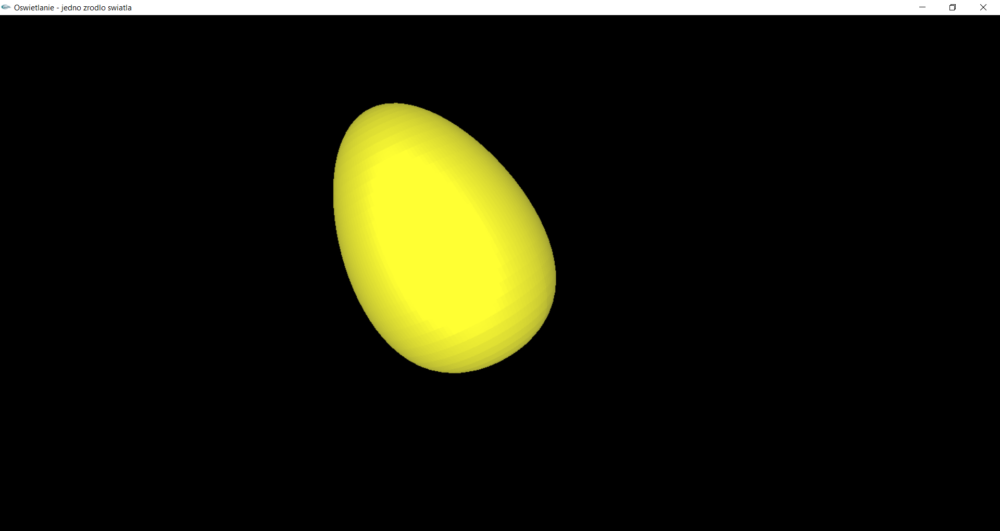

# OpenGL
> This repository contains programs forming wire, solid shapes by using Open Graphics Library.

## Table of contents
* [Technologies](#technologies)
* [Setup](#setup)
* Bezier curve
    * [General info](#general-info)
    * [Screenshots](#screenshots)
    * [Status](#status)
* Egg shape
    * [General info](#general-info-1)
    * [Screenshots](#screenshots-1)
    * [Status](#status-1)
* Egg casting
    * [General info](#general-info-2)
    * [Screenshots](#screenshots-2)
    * [Status](#status-2)
* Egg lighting
    * [General info](#general-info-3)
    * [Screenshots](#screenshots-3)
    * [Status](#status-3)
* Egg texturing    
    * [General info](#general-info-4)
    * [Screenshots](#screenshots-4)
    * [Status](#status-4)
* Pyramid texturing    
    * [General info](#general-info-5)
    * [Screenshots](#screenshots-5)
    * [Status](#status-5)
* Sierpinski carpet    
    * [General info](#general-info-6)
    * [Screenshots](#screenshots-6)
    * [Status](#status-6)
* Teapot casting    
    * [General info](#general-info-7)
    * [Screenshots](#screenshots-7)
    * [Status](#status-7)
* Teapot lighting
    * [General info](#general-info-8)
    * [Screenshots](#screenshots-8)
    * [Status](#status-8)
* [Contact](#contact)

## Technologies
* C++ along with the use OpenGL graphic library with the GL Utility Toolkit extension (GLUT).

## Setup
Programs placed in the repository will require the GLUT (OpenGL Utility Toolkit) library. However, if you do not have one in your development environment, install the library as follows:
* Download and unpack library files <b></b>
* Locate the folder in which the gl.h file is located and place the glut.h file there
* Locate the folder in which the opengl32.lib file is located and place the glut32.lib file there
* Locate the folder in which the opengl32.dll file is located and place the glut32.dll file there

# Bezier Curve
## General info

## Screenshots

## Status
Project is: _finished_.

# Egg shape
## General info

## Screenshots

## Status
Project is: _finished_.

# Egg casting
## General info

## Screenshots

## Status
Project is: _finished_.

# Egg lighting
## General info

## Screenshots

## Status
Project is: _finished_.

# Egg texturing
## General info

## Screenshots

## Status
Project is: _finished_.

# Pyramid texturing
## General info

## Screenshots

## Status
Project is: _finished_.

# Sierpinski carpet
## General info

## Screenshots

## Status
Project is: _finished_.

# Teapot casting  
## General info

## Screenshots

## Status
Project is: _finished_.

# Teapot lighting 
## General info

## Screenshots

## Status
Project is: _finished_.

## Contact
Created by [@PJasiczek](http://www.piotrjasiczek.pl/) - feel free to contact me!
