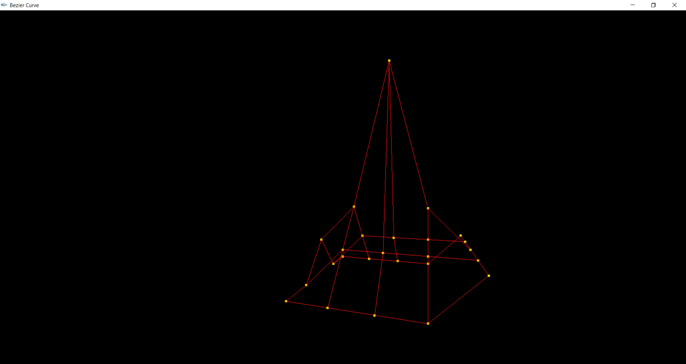

# OpenGL
> This repository contains programs forming wire shapes by using Open Graphics Library

## Table of contents
* Bezier curve
    * [Technologies](#technologies)
    * [Setup](#setup)
    * [General info](#general-info)
    * [Screenshots](#screenshots)
    * [Status](#status)
* Egg shape
    * [General info](#general-info-1)
    * [Screenshots](#screenshots-1)
    * [Status](#status-1)
    * [General info](#general-info-2)
    * [Screenshots](#screenshots-2)
    * [Status](#status-2)
    * [General info](#general-info-3)
    * [Screenshots](#screenshots-3)
    * [Status](#status-3)
    * [General info](#general-info-4)
    * [Screenshots](#screenshots-4)
    * [Status](#status-4)
    * [General info](#general-info-5)
    * [Screenshots](#screenshots-5)
    * [Status](#status-5)
    * [General info](#general-info-6)
    * [Screenshots](#screenshots-6)
    * [Status](#status-6)
    * [General info](#general-info-7)
    * [Screenshots](#screenshots-7)
    * [Status](#status-7)
    * [General info](#general-info-8)
    * [Screenshots](#screenshots-8)
    * [Status](#status-8)
* [Contact](#contact)

## Technologies
* C++ along with the use OpenGL graphic library with the GL Utility Toolkit extension (GLUT).

## Setup

# Bezier Curve
## General info

## Screenshots

## Status
Project is: _finished_.

## General info

## Screenshots

## Status
Project is: _finished_.

# Egg shape
## General info

## Screenshots

## Status
Project is: _finished_.

## General info

## Screenshots

## Status
Project is: _finished_.

## General info

## Screenshots

## Status
Project is: _finished_.

## General info

## Screenshots

## Status
Project is: _finished_.

## General info

## Screenshots

## Status
Project is: _finished_.

## General info

## Screenshots

## Status
Project is: _finished_.

## General info

## Screenshots

## Status
Project is: _finished_.

## Contact
Created by [@PJasiczek](http://www.piotrjasiczek.pl/) - feel free to contact me!
