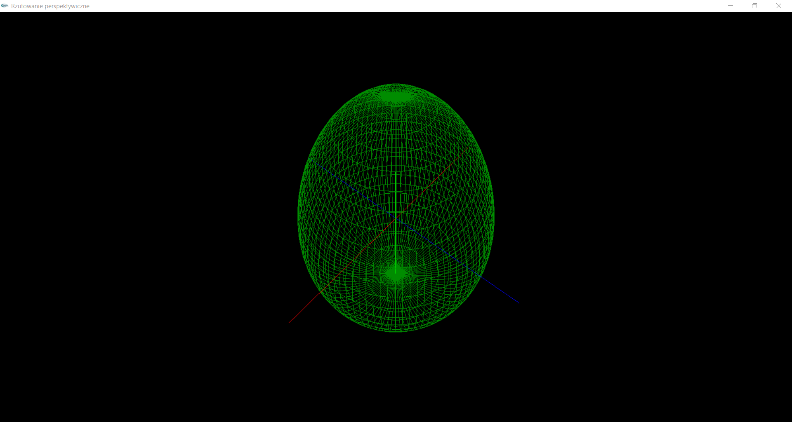

# OpenGL
> This repository contains programs forming wire, solid shapes by using Open Graphics Library.

## Table of contents
* [Technologies](#technologies)
* [Setup](#setup)
* Bezier curve
    * [General info](#general-info)
    * [Screenshots](#screenshots)
    * [Status](#status)
* Egg shape
    * [General info](#general-info-1)
    * [Screenshots](#screenshots-1)
    * [Status](#status-1)
* Egg casting
    * [General info](#general-info-2)
    * [Screenshots](#screenshots-2)
    * [Status](#status-2)
* Egg lighting
    * [General info](#general-info-3)
    * [Screenshots](#screenshots-3)
    * [Status](#status-3)
* Egg texturing    
    * [General info](#general-info-4)
    * [Screenshots](#screenshots-4)
    * [Status](#status-4)
* Egg two sources lighting
    * [General info](#general-info-5)
    * [Screenshots](#screenshots-5)
    * [Status](#status-5)
* Pyramid texturing    
    * [General info](#general-info-6)
    * [Screenshots](#screenshots-6)
    * [Status](#status-6)
* Sierpinski carpet    
    * [General info](#general-info-7)
    * [Screenshots](#screenshots-7)
    * [Status](#status-7)
* Teapot casting    
    * [General info](#general-info-8)
    * [Screenshots](#screenshots-8)
    * [Status](#status-8)
* Teapot lighting
    * [General info](#general-info-9)
    * [Screenshots](#screenshots-9)
    * [Status](#status-9)
* [Contact](#contact)

## Technologies
* C++ along with the use OpenGL graphic library with the GL Utility Toolkit extension (GLUT).

## Setup
Programs placed in the repository will require the GLUT (OpenGL Utility Toolkit) library. However, if you do not have one in your development environment, install the library as follows:
* Download and unpack library files [glut-3.7](./library/glut_3_7.zip)
* Locate the folder in which the gl.h file is located and place the glut.h file there
* Locate the folder in which the opengl32.lib file is located and place the glut32.lib file there
* Locate the folder in which the opengl32.dll file is located and place the glut32.dll file there

# Bezier Curve
## General info
The program draws a set grid of control points in the form of small balls connected with thin lines. After pressing the key _W_, an approximation of the Bezier surface appears in the drawing. Program was created for the needs of the laboratory in the subject called Computer Graphics. The content of the task has been placed [here](http://www.zsk.ict.pwr.wroc.pl/zsk/repository/dydaktyka/gk/zadania_domowe/zadania_3.pdf).

## Screenshots

## Status
Project is: _finished_.

# Egg shape
## General info
Program create spinning shape of the egg with three different models.
* Key _P_ switch to egg model built from _N_ points
* Key _W_ switch to egg model in the form of a grid formed from a combination of _N_ points
* Key _W_ switch to egg model built from randomly filled triangles

Program was created for the needs of the laboratory in the subject called Computer Graphics. The content of the task has been placed [here](http://www.zsk.ict.pwr.wroc.pl/zsk/dyd/intinz/gk/lab/cw_3_dz/).

## Screenshots

## Status
Project is: _finished_.

# Egg casting
## General info
Program create a shape of the egg with mouse listener function to rotate an object.
* With the left mouse button pressed, moving the mouse cursor in the horizontal direction causes the object to rotate around the y axis
* With the left mouse button pressed, moving the mouse cursor in the vertical direction causes the object to rotate around the x axis
* When the right mouse button is pressed, the mouse cursor moves in the vertical direction and the observer moves closer to the object

Program was created for the needs of the laboratory in the subject called Computer Graphics. The content of the task has been placed [here](http://www.zsk.ict.pwr.wroc.pl/zsk/dyd/intinz/gk/lab/cw_4_dz/).

## Screenshots

## Status
Project is: _finished_.

# Egg lighting
## General info
Program create a spinnging shape of the egg illuminated with yellow light. Program was created for the needs of the laboratory in the subject called Computer Graphics. The content of the task has been placed [here](http://www.zsk.ict.pwr.wroc.pl/zsk/dyd/intinz/gk/lab/cw_5_dz/).

## Screenshots

## Status
Project is: _finished_.

# Egg texturing
## General info
Program create a textured shape of the egg with mouse listener function to rotate an object. 
* With the left mouse button pressed, moving the mouse cursor in the horizontal direction causes the object to rotate around the y axis
* With the left mouse button pressed, moving the mouse cursor in the vertical direction causes the object to rotate around the x axis
* When the right mouse button is pressed, the mouse cursor moves in the vertical direction and the observer moves closer to the object

Program was created for the needs of the laboratory in the subject called Computer Graphics. The content of the task has been placed [here](http://www.zsk.ict.pwr.wroc.pl/zsk/dyd/intinz/gk/lab/cw_6_dz/).

## Screenshots

## Status
Project is: _finished_.

# Egg two sources lighting
## General info
Program create a shape of the egg illuminated with two different lighths sources. The same as in previous programs, it is possible to change the position of the object observer through mouse listener function to rotate an object.
* With the left mouse button pressed, moving the mouse cursor in the horizontal direction causes the object to rotate around the y axis
* With the left mouse button pressed, moving the mouse cursor in the vertical direction causes the object to rotate around the x axis
* When the right mouse button is pressed, the mouse cursor moves in the vertical direction and the observer moves closer to the object

Program was created for the needs of the laboratory in the subject called Computer Graphics. The content of the task has been placed [here](http://www.zsk.ict.pwr.wroc.pl/zsk/dyd/intinz/gk/lab/cw_5_dz/).

## Screenshots

## Status
Project is: _finished_.

# Pyramid texturing
## General info
Program create a textured pyramid with mouse listener function to rotate an object.
* With the left mouse button pressed, moving the mouse cursor in the horizontal direction causes the object to rotate around the y axis
* With the left mouse button pressed, moving the mouse cursor in the vertical direction causes the object to rotate around the x axis
* When the right mouse button is pressed, the mouse cursor moves in the vertical direction and the observer moves closer to the object

Each wall was assigned a key with the help of which we turn off and turn on surface texturing.
* Key _P_ enable/disable texturing of one of the walls of the pyramid
* Key _O_ enable/disable texturing of one of the walls of the pyramid
* Key _I_ enable/disable texturing of one of the walls of the pyramid
* Key _U_ enable/disable texturing of one of the walls of the pyramid
* Key _Y_ switches texture of the pyramid surface to texturing one or two sides
* Key _T_ enable/disable texturing the surface of the pyramid

Program was created for the needs of the laboratory in the subject called Computer Graphics. The content of the task has been placed [here](http://www.zsk.ict.pwr.wroc.pl/zsk/dyd/intinz/gk/lab/cw_6_dz/).

## Screenshots

## Status
Project is: _finished_.

# Sierpinski carpet
## General info
Program create the Sierpinski carpet object. Program was created for the needs of the laboratory in the subject called Computer Graphics. The content of the task has been placed [here](http://www.zsk.ict.pwr.wroc.pl/zsk/dyd/intinz/gk/lab/cw_2_dz/).

## Screenshots

## Status
Project is: _finished_.

# Teapot casting  
## General info
Program create a wire teapot with mouse listener function to rotate an object.
* With the left mouse button pressed, moving the mouse cursor in the horizontal direction causes the object to rotate around the y axis
* With the left mouse button pressed, moving the mouse cursor in the vertical direction causes the object to rotate around the x axis
* When the right mouse button is pressed, the mouse cursor moves in the vertical direction and the observer moves closer to the object

Program was created for the needs of the laboratory in the subject called Computer Graphics. The content of the task has been placed [here](http://www.zsk.ict.pwr.wroc.pl/zsk/dyd/intinz/gk/lab/cw_4_dz/).

## Screenshots

## Status
Project is: _finished_.

# Teapot lighting 
## General info
Program create a solid teapot illuminated with white light. The same as in previous programs, it is possible to change the position of the object observer through mouse listener function to rotate an object.
* With the left mouse button pressed, moving the mouse cursor in the horizontal direction causes the object to rotate around the y axis
* With the left mouse button pressed, moving the mouse cursor in the vertical direction causes the object to rotate around the x axis
* When the right mouse button is pressed, the mouse cursor moves in the vertical direction and the observer moves closer to the object

Program was created for the needs of the laboratory in the subject called Computer Graphics. The content of the task has been placed [here](http://www.zsk.ict.pwr.wroc.pl/zsk/dyd/intinz/gk/lab/cw_5_dz/).

## Screenshots

## Status
Project is: _finished_.

## Contact
Created by [@PJasiczek](http://www.piotrjasiczek.pl/) - feel free to contact me!
